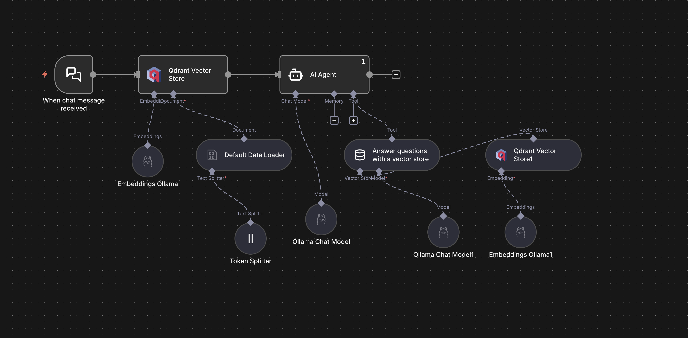

# Local Private RAG AI Agent 🤖

This project is an automation workflow built in **n8n** that creates a private, local "Chat with your Data" experience. It uses **Retrieval-Augmented Generation (RAG)** to allow users to upload documents and ask questions about them without sending data to external APIs like OpenAI.

## 📸 Architecture

## 🛠 Tech Stack
- **Orchestration:** n8n
- **LLM:** Ollama (Llama 3.2)
- **Vector Database:** Qdrant (Local)
- **Framework:** LangChain

## 🚀 How It Works
1. **Ingestion:** The user uploads a file via the chat interface.
2. **Embeddings:** The file is parsed and split into chunks; embeddings are generated using Llama 3.2.
3. **Storage:** Vectors are stored in Qdrant with a dynamic collection ID based on the user's session.
4. **Retrieval:** When the user asks a question, an AI Agent determines if it needs to look up the document.
5. **Response:** The agent retrieves relevant context from Qdrant and generates an answer.

## 💻 How to Use
1. Install [n8n](https://n8n.io/), [Ollama](https://ollama.com/), and [Qdrant](https://qdrant.tech/).
2. Pull the Llama 3.2 model: `ollama pull llama3.2`.
3. Import `n8n-rag-workflow.json` into your n8n instance.
4. Update the credentials for your local Qdrant and Ollama instances.
